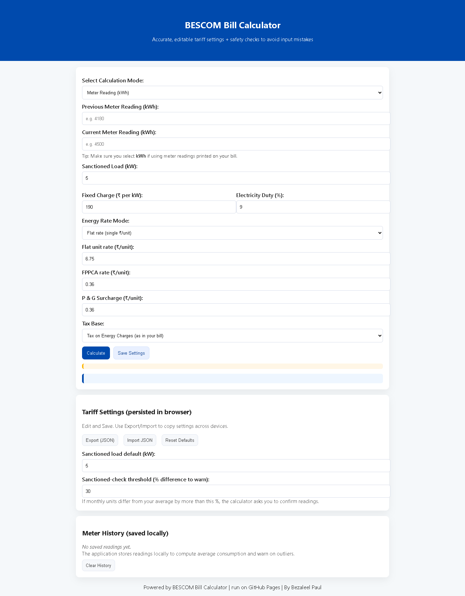

# BESCOM Bill Calculator 🏠⚡

**Dynamic, interactive, and user-friendly web application to calculate your BESCOM electricity bill accurately, with full line-item breakdown and anomaly detection.**

---

## 🌐 Live Demo

Check out the working website here:
[https://bezaleelpaul.github.io/BESCOM-Calculator/](https://bezaleelpaul.github.io/BESCOM-Calculator/)

---

## 🔹 Features

* **Multiple Calculation Modes:**

  * **kWh Mode:** Calculate using previous & current meter readings.
  * **kVAh Mode:** Convert kVAh readings to kWh using power factor.
  * **Appliance Estimation:** Estimate usage based on individual appliances (wattage × hours × days).

* **Full Bill Breakdown:**

  * **Fixed Charges:** Based on sanctioned load (kW).
  * **Energy Charges:** Slab-wise calculation using BESCOM tariff.
  * **FPPCA Charges:** Fuel & power purchase cost adjustment.
  * **P & G Surcharge:** Government portion.
  * **Taxes:** 9% electricity duty.
  * **Additional Charges:** PF penalty, excess load/MD penalty, interest, debit/credit.
  * **Current Demand & Net Payable:** Calculates total bill including arrears.

* **Dynamic & Interactive:**

  * Change any **unit rates, fixed charges, tax, or surcharge** dynamically.
  * Instant calculation without page reload.
  * Auto-updates totals when values change.

* **Scam/Anomaly Detection:**

  * Alerts if units consumed are **unusually high or inconsistent with historical usage**.
  * Helps prevent errors due to incorrect meter readings.

* **Modern UI & UX:**

  * Responsive and mobile-friendly design.
  * Aesthetic inspired by BESCOM website with a clean, intuitive interface.
  * Clear display of all charges and line items.

* **Completely Free:**

  * Runs entirely in the browser.
  * Hosted on GitHub Pages—no backend required.

---

## 📊 Example Usage

1. Select calculation mode: **kWh**, **kVAh**, or **Appliance Estimation**.

2. Enter your meter readings, appliance data, or other parameters.

3. Optionally, update:

   * Fixed charges per kW
   * Tariff slab rates
   * FPPCA and P&G rates
   * Tax percentage

4. View:

   * Total units consumed
   * Fixed charges, energy charges, and additional charges
   * Slab-wise breakdown
   * Net payable amount
   * Anomaly/scam alerts if usage is irregular

---

## 💻 Technologies Used

* HTML5, CSS3
* JavaScript (Dynamic Calculation & UI)
* GitHub Pages (Free Hosting)

---

## 🚀 How to Use

1. Clone or download the repository.
2. Open `index.html` in your browser.
3. Or access it directly on GitHub Pages: [Live Demo](https://bezaleelpaul.github.io/BESCOM-Calculator/)

---

## 🔹 Notes

* Fully compliant with **BESCOM domestic tariff structure** (Bangalore, 2025).
* Designed for **educational, personal use**, and **bill verification**.
* Dynamic update feature ensures your calculator **remains accurate even if BESCOM updates tariffs**.

---

