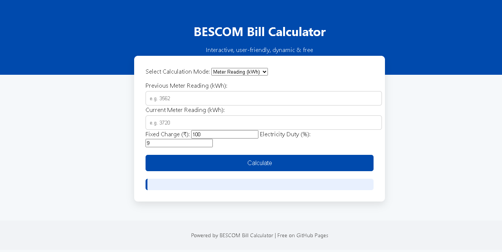

---

# BESCOM Bill Calculator 🏠⚡

**Dynamic, interactive, and user-friendly web application to calculate your BESCOM electricity bill accurately.**

---

## 🌐 Live Demo

Check out the working website here:
[https://bezaleelpaul.github.io/BESCOM-Calculator/](https://bezaleelpaul.github.io/BESCOM-Calculator/)

---

## 🔹 Features

* **Multiple Calculation Modes:**

  * **kWh Mode:** Calculate using meter readings.
  * **kVAh Mode:** Convert kVAh readings to kWh using power factor.
  * **Appliance Estimation:** Estimate usage based on individual appliances (wattage × hours × days).

* **Slab-wise Bill Breakdown:**

  * Calculates energy charges for each BESCOM tariff slab.
  * Includes fixed charges and electricity duty.

* **Dynamic & Interactive:**

  * Instant calculation without page reload.
  * Clear display of results and slab-wise charges.

* **Scam/Anomaly Detection:**

  * Warns if units are unusually high.
  * Helps prevent errors due to incorrect meter readings.

* **Modern UI:**

  * Responsive, mobile-friendly design inspired by BESCOM’s look.
  * Clean and intuitive interface for all users.

* **Completely Free:**

  * Runs entirely in the browser.
  * Hosted on GitHub Pages—no backend required.

---

## 📊 Example Usage

1. Select the calculation mode: **kWh**, **kVAh**, or **Appliance Estimation**.
2. Enter your meter readings or appliance details.
3. View:

   * Total units consumed
   * Energy charges per slab
   * Fixed charges
   * Electricity duty
   * Total bill
   * Scam alert if applicable

---

## 💻 Technologies Used

* HTML5, CSS3
* JavaScript (Dynamic Calculation & UI)
* GitHub Pages (Free Hosting)

---

## 🚀 How to Use

1. Clone or download the repository.
2. Open `index.html` in your browser.
3. Or access it directly on GitHub Pages: [Live Demo](https://bezaleelpaul.github.io/BESCOM-Calculator/)

---

## 🔹 Notes

* Fully compliant with **BESCOM domestic tariff structure** (Bangalore, 2025).
* Designed for **educational and personal use**.

---

Do you want me to do that?
